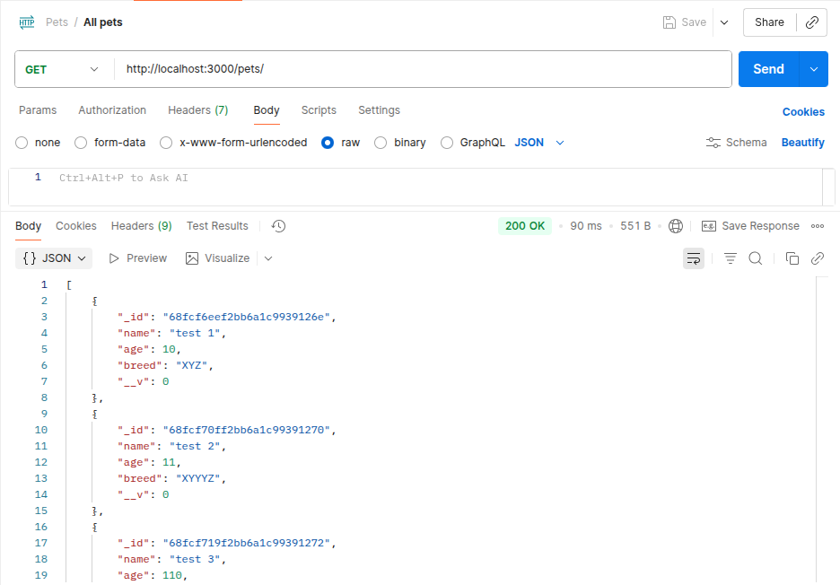
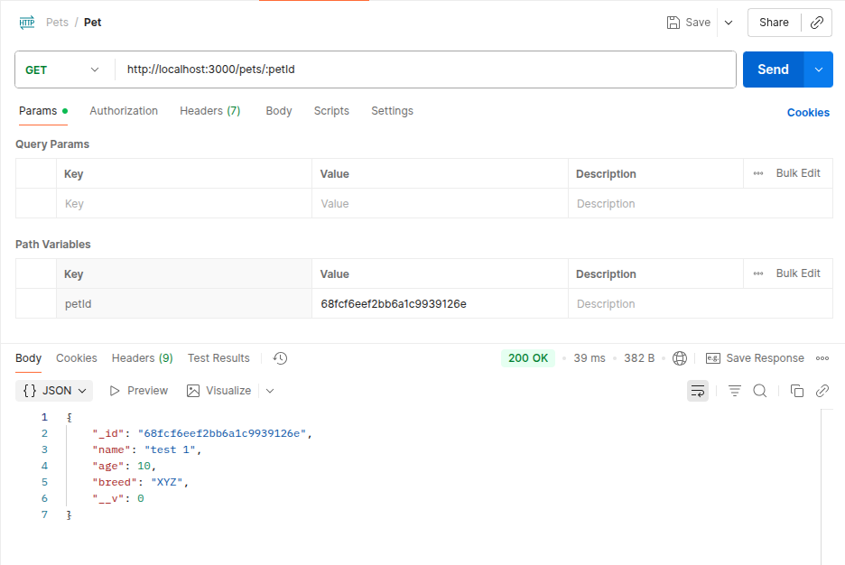
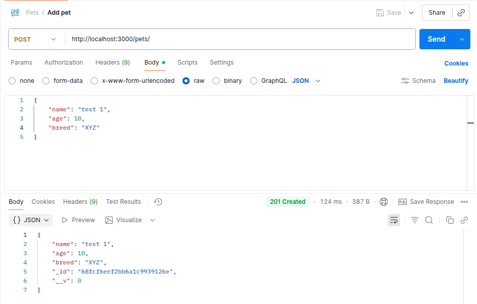
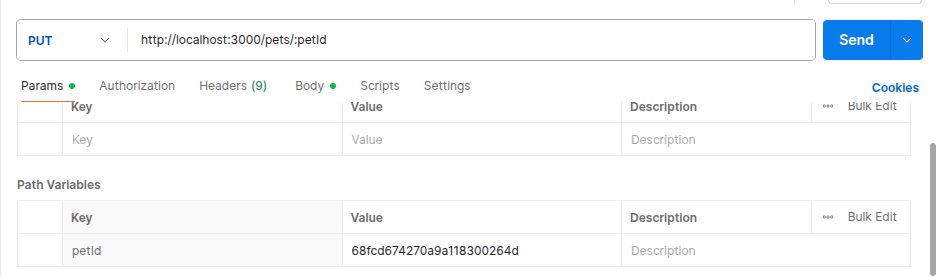
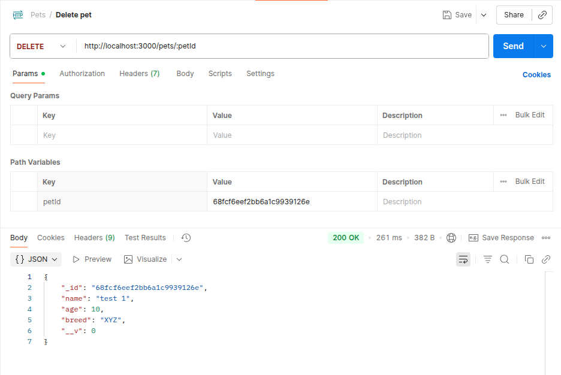

# Back-end Routes with Postman

A RESTful API for managing pets with Express.js, MongoDB, and Mongoose, tested with Postman.

## 🚀 Technologies Used

- **Backend**: Node.js, Express.js
- **Database**: MongoDB with Mongoose ODM
- **Middleware**: CORS, Morgan logger
- **Testing**: Postman
- **Environment**: dotenv for configuration


## 🗂️ API Routes

### Base URL: `http://localhost:3000`

| Method | Endpoint | Description | Status Codes |
|--------|----------|-------------|--------------|
| GET | `/pets` | Get all pets | 200, 500 |
| GET | `/pets/:petId` | Get single pet by ID | 200, 404, 500 |
| POST | `/pets` | Create new pet | 200, 500 |
| PUT | `/pets/:petId` | Update pet by ID | 201, 404, 500 |
| DELETE | `/pets/:petId` | Delete pet by ID | 200, 404, 500 |

## 📋 Pet Model Schema

```javascript
{
  name: {
    type: String,
    required: true
  },
  age: {
    type: Number,
    min: 0,
    required: true
  },
  breed: String
}
```

## 🧪 API Testing with Postman

### 📸 Postman Test Results

#### 1. GET All Pets

*Retrieve all pets from the database*

#### 2. GET Single Pet

*Retrieve a specific pet by ID*

#### 3. POST Create Pet

*Create a new pet with validation*

#### 4. PUT Update Pet

*Update pet information with validation*

#### 5. DELETE Pet

*Remove a pet from the database*

## 🔒 Features

- **Data Validation**: Mongoose schema validation with custom rules
- **Error Handling**: Comprehensive error handling for all routes
- **CORS Enabled**: Cross-origin requests allowed for frontend integration
- **RESTful Design**: Standard REST API conventions
- **Input Sanitization**: Prevents invalid data with schema constraints
